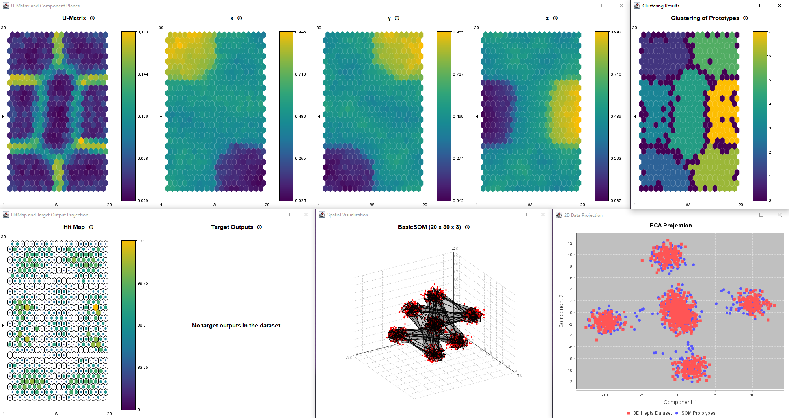

# Ubiquitous Neural Networks

Ubiquitous Neural Networks is a framework and collection of neural network models that stemmed from my
[PhD Thesis](http://hdl.handle.net/10362/19974). The original code was completely refactored and is
now made available through this project. 

It allows you to easily build and train neural networks in Java; you can also extend the core functionality for particular use-cases.

It includes a variety of features and visualizations to help you create powerful and accurate models for your data.


:construction: Check out the [Wiki pages](https://github.com/brunomnsilva/UbiquitousNeuralNetworks/wiki).

## Features

### Models

This project implements three types of **neural network models and variants**:

- **`SelfOrganizingMap`** (SOM): a type of neural network that projects high-dimensional data onto a 2d map, maintaining input-space topological relationships. Useful for exploratory cluster analysis and, possibly, classification.
  - `BasicSOM` - *Classical* and *Batch* algorithms are available;
  - For *streaming data*, i.e., variants that can learn incrementally over time, estimating its learning parameters on-the-fly:
    - `UbiSOM` - The Ubiquitous Self-Organizing Map (*a contribution from my thesis*);
    - `PLSOM` - The Parameterless Self-Organizing Map;
    - `DSOM` - The Dynamic Self-Organizing Map.

  > All SOM models allow setting the lattice type (hexagonal or rectangular) and the metric distance to use (euclidean or manhattan); but you
  > can easily create your own lattices and metric distances. 

- **`StreamART2A`** (*a contribution from my thesis*): a neural network architecture, based on Adaptive Resonance Theory, that uses a process of competitive learning and resonance to summarize input patterns in streaming data.

- **`MLPNetwork` (Multilayer Perceptron)**: a feedforward neural network architecture consisting of multiple layers of nodes that can approximate any function with enough hidden units. Useful for classification and regression.

  > You can create deep learning models and comes with several activation functions, e.g., linear, ReLU, sigmoid and tanh.

### Data and preprocessing

- Data is imported through the `Dataset` class. Data set files must have a *yaml* header describing it - see examples in the `datasets` folder;
- There are two implementations of `DatasetNormalization`, namely `MinMaxNormalization` and `MeanNormalization`. You can add others;
- The class `DatasetTrainSplit`, as the name suggests, allows you to easily split your data for training and testing;
- The library comes with an implementation of `PCA` data projection.

### Visualizations

Contains different types of visualizations for all available models and a simple plotting class.

#### Self-Organizing Maps



- U-matrix
- Component planes
- Hit-Map
- Spatial visualization of input data and lattice
- Clustering of prototypes
- ...

#### StreamART2A


- Spatial visualization of input data and generated micro-categories

#### MLP Networks


- Network architecture, weights and bias

## Documentation

### Installation

Binaries and dependency information for Maven, Gradle and others can be found at [http://search.maven.org](https://central.sonatype.com/search?q=g%3Acom.brunomnsilva++a%3Aneuralnetworks&smo=true).

Example for Maven:

```xml
<dependency>
    <groupId>com.brunomnsilva</groupId>
    <artifactId>neuralnetworks</artifactId>
    <version>x.y.z</version>
</dependency>
```

You need Java 9 or later.

Some *transient* dependencies are used, namely:

- [snakeyaml](https://mvnrepository.com/artifact/org.yaml/snakeyaml)
- [colt](https://mvnrepository.com/artifact/colt/colt)
- [commons-math3](https://mvnrepository.com/artifact/org.apache.commons/commons-math3)
- [jcommon](https://mvnrepository.com/artifact/org.jfree/jcommon)
- [jfreechart](https://mvnrepository.com/artifact/org.jfree/jfreechart)
- [jfreesvg](https://mvnrepository.com/artifact/org.jfree/jfreesvg)
- [JMathPlot](https://mvnrepository.com/artifact/com.github.yannrichet/JMathPlot)

### API Reference

[](https://javadoc.io/doc/com.brunomnsilva/neuralnetworks)


### Usage and examples

:construction: Check out the [Wiki pages](https://github.com/brunomnsilva/UbiquitousNeuralNetworks/wiki).

:warning: Until they are populated with examples, you can check some usage examples in the `neuralnetworks-examples` folder.

### Citing

At the moment, you can cite this framework with the following publication:

:book: Marques, N. C., & Silva, B. (2023). Exploratory cluster analysis using self-organizing maps: Algorithms, methodologies, and framework. In L. Moutinho, L. Cavique, & E. Bigné (Eds.), Philosophy of Artificial Intelligence and Its Place in Society (pp. 187-213). IGI Global. https://doi.org/10.4018/978-1-6684-9591-9.ch010

#### Publications

If you use this *framework* in your research, please reach out so I can reference your publications here.

## Contributing

You can fork the repository and submit a pull request. Pull requests should adhere to the existing naming and *Javadoc* conventions.

## License

This project is licensed under the MIT License - see the [LICENSE](LICENSE) file for details. 
All derivative work should include this license.

## Authors

Original author: **Bruno Silva** - [(GitHub page)](https://github.com/brunomnsilva) | [(Personal page)](https://www.brunomnsilva.com/) | [(:portugal: CIÊNCIA VITAE)](https://www.cienciavitae.pt/portal/FB1E-5676-5A51)

### Contributors

(no others, at the moment)

---

I hope you find Ubiquitous Neural Networks useful and look forward to seeing the projects you create with it!